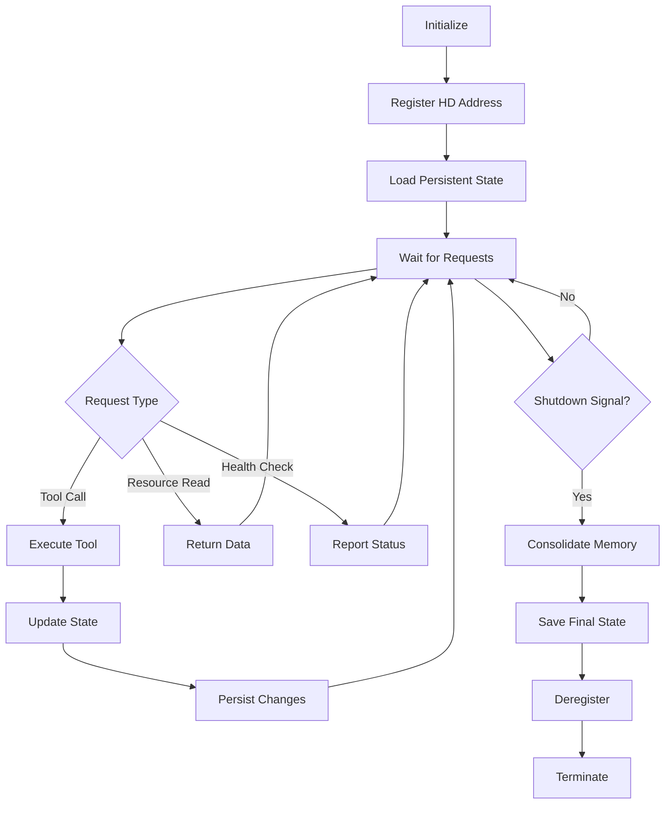

# AI Agents in Epistemic Topology

**Version:** 1.0
**Date:** 2025-11-04
**Status:** ✅ Production-Ready

---

## Table of Contents

1. [Overview](#overview)
2. [Agent Architecture](#agent-architecture)
3. [Agent Types](#agent-types)
4. [Persistence and Memory](#persistence-and-memory)
5. [Federated Identity with HD Addressing](#federated-identity-with-hd-addressing)
6. [Agent Collaboration Patterns](#agent-collaboration-patterns)
7. [Practical Workflows](#practical-workflows)
8. [Security and Coordination](#security-and-coordination)
9. [Quick Reference](#quick-reference)

---

## Overview

The Epistemic Topology project is fundamentally an **agent-based system** where multiple AI agents collaborate to analyze, learn from, and reason about distributed systems. This document explains how agents work, persist knowledge, identify themselves, and coordinate actions.

### What is an Agent?

In this context, an **agent** is an autonomous entity that:
- **Perceives** the environment (code, data, user queries)
- **Reasons** using specialized capabilities (CST analysis, H²GNN learning, DANL consensus)
- **Acts** by executing tools, creating outputs, or modifying state
- **Learns** from interactions and persists knowledge for future use
- **Collaborates** with other agents via federated identity and shared protocols

### Agent Ecosystem

```
┌─────────────────────────────────────────────────────────┐
│  User (via Claude Code CLI)                            │
└────────────────────┬────────────────────────────────────┘
                     │ Natural Language + Tool Calls
                     ▼
┌─────────────────────────────────────────────────────────┐
│  Claude Code Agent (Orchestrator)                       │
│  - Understands user intent                              │
│  - Plans task sequences                                 │
│  - Invokes specialized agents via MCP                   │
│  - Synthesizes results                                  │
└──────┬────────────┬────────────┬──────────────┬─────────┘
       │            │            │              │
       ▼            ▼            ▼              ▼
┌──────────┐ ┌──────────┐ ┌──────────┐ ┌──────────────┐
│H²GNN     │ │CST       │ │DANL      │ │Other MCP     │
│Agent     │ │Agent     │ │Executor  │ │Servers       │
└──────────┘ └──────────┘ └──────────┘ └──────────────┘
       │            │            │              │
       └────────────┴────────────┴──────────────┘
                     │
                     ▼
       ┌─────────────────────────────┐
       │  Persistence Layer          │
       │  - JSON file storage        │
       │  - Hyperbolic embeddings    │
       │  - Learning progress        │
       └─────────────────────────────┘
```

### Key Principles

1. **Specialization**: Each agent has domain expertise (topology, learning, execution)
2. **Autonomy**: Agents make decisions within their domain without central coordination
3. **Persistence**: Agents remember past interactions via structured storage
4. **Identity**: Agents have unique HD addresses enabling federated discovery
5. **Collaboration**: Agents communicate via MCP protocol with standardized interfaces

---

## Agent Architecture

### Three-Layer Agent Stack

#### Layer 1: Perception and Tool Execution

Agents perceive their environment through:
- **File system reads**: Access to code, documentation, configuration
- **MCP resources**: Structured data from other agents (memories, topologies, graphs)
- **User messages**: Natural language instructions and feedback
- **System events**: Tool results, errors, state changes

Agents act through:
- **MCP tools**: Invoke capabilities of other agents
- **File operations**: Create, modify, analyze files
- **Shell commands**: Execute system operations
- **API calls**: Interact with external services

#### Layer 2: Reasoning and Decision-Making

Agents reason using:
- **Domain models**: CST's algebraic topology, H²GNN's hyperbolic geometry, DANL's lattice semantics
- **Planning algorithms**: Task decomposition, dependency analysis, goal satisfaction
- **Heuristics**: Performance optimization, resource management, error recovery
- **Learning**: Pattern recognition, confidence scoring, adaptive behavior

#### Layer 3: Memory and Identity

Agents persist and identify through:
- **Structured storage**: JSON-based memories, snapshots, progress tracking
- **HD addressing**: Hierarchical deterministic identifiers (BIP32-style)
- **Hyperbolic coordinates**: Geometric position in service space
- **RPC endpoints**: Deterministic service discovery

### Agent Lifecycle



---

## Agent Types

### 1. Claude Code Agent (Orchestrator)

**Role:** Primary interface between user and specialized agents

**Capabilities:**
- Natural language understanding
- Task planning and decomposition
- Multi-agent coordination
- Result synthesis
- User communication

**HD Address:** N/A (client, not server)

**Example Workflow:**
```
User: "Analyze the DANL code and learn its patterns"

Claude Code:
1. Plans task: CST analysis → H²GNN learning → Report generation
2. Invokes CST agent: analyze_program(danl_source)
3. Invokes H²GNN agent: learn_concept("danl_patterns", cst_results)
4. Synthesizes: Creates integration report
5. Responds to user with summary
```

### 2. H²GNN Agent (Learning and Knowledge)

**Role:** Learn patterns, create embeddings, maintain knowledge graphs

**HD Address:** `m/0x4852474E'/0x00000001'/0'/1/0` (Enhanced variant)

**Capabilities:**
- **Learning**: Store concepts with 128-dim hyperbolic embeddings
- **Retrieval**: Semantic search via hyperbolic distance
- **Consolidation**: Merge related concepts into understanding snapshots
- **Adaptation**: Track learning progress and adjust strategies
- **Collaboration**: Team-based learning with shared standards

**Persistent State:**
```
persistence/danl-h2gnn/
├── memories/           # Individual learned concepts
│   ├── memory_ta8mwgbdz.json  # danl_lattice_structure
│   ├── memory_m111aq8eo.json  # danl_fixpoint_combinators
│   └── ...
├── snapshots/          # Consolidated understanding
│   └── snapshot_general_concepts_8m65fva0n.json
└── progress/           # Learning curves
    └── general.json    # Mastery: 0.35, Concepts: 4
```

**Example Tool Call:**
```python
# Learn a new concept
response = await h2gnn_agent.learn_concept_hd(
    concept="distributed_consensus_pattern",
    data={
        "algorithm": "lattice-based",
        "complexity": {"h1": 0, "vg": 188},
        "properties": ["monotonic", "convergent"]
    },
    context={
        "domain": "distributed-systems",
        "language": "scheme",
        "complexity": 0.8
    },
    performance=0.9
)
# Returns: memory_id, confidence=0.95, h2gnnAddress, rpcEndpoint
```

### 3. CST Agent (Computational Scheme Theory)

**Role:** Analyze program complexity via algebraic topology

**HD Address:** `m/0x43535448'/0x00000001'/0'/0/0` (Base variant)

**Capabilities:**
- **H¹ Cohomology**: Compute topological complexity from binding structure
- **V(G) Complexity**: Measure cyclomatic complexity via control flow graphs
- **Hypothesis Validation**: Test H¹ = V(G) - k relationship
- **Combinator Detection**: Identify Y/Z combinators, fixed-point operators
- **Natural Language Processing**: Convert queries to M-expressions (SGP-ASLN)

**Persistent State:**
```
MCP Resources (in-memory):
├── bindings          # Binding algebra (R_Scheme rig)
├── topology          # Scope topology (Zariski)
└── knowledge-graph   # Semantic relationships
```

**Example Tool Call:**
```python
# Analyze program complexity
result = await cst_agent.analyze_program(scheme_source_code)
# Returns: {
#   "h1": 0,                     # Flat binding structure
#   "vg": 188,                   # High control flow complexity
#   "bindings": 1,
#   "combinators": [],
#   "cfg": {"nodes": 99, "edges": 99}
# }

# Validate hypothesis
validation = await cst_agent.validate_hypothesis(h1=0, v_g=188, k=188)
# Returns: {"valid": true, "difference": 0, "message": "..."}
```

### 4. DANL Executor Agent

**Role:** Execute distributed automaton network simulations

**HD Address:** `m/0x44414E4C'/0x00000001'/0'/0/0` (Base variant)
**RPC Endpoint:** `tcp://localhost:3000/danl/base/0`
**MCP Server:** `@epistemic-topology/danl-mcp-server` (v1.0.0)

**Capabilities:**
- **Lattice Operations**: join, meet, blend over epistemic certainty levels
- **Network Simulation**: Execute multi-node consensus with fixpoint detection
- **M/S-Expression Evaluation**: Homoiconic meta/structural duality
- **Observable Parameterization**: τ-coefficient tracking for implicit knowledge
- **Trace Generation**: Export execution history for analysis
- **Convergence Validation**: Fixpoint detection verification
- **Cross-Language Validation**: Compare Scheme, Prolog, Datalog results

**Tools (8 available):**
- `mcp__danl__simulate_network` - Run network simulation until convergence
- `mcp__danl__lattice_join` - Compute maximum (optimistic consensus)
- `mcp__danl__lattice_meet` - Compute minimum (conservative consensus)
- `mcp__danl__get_level_index` - Map lattice level to numeric index
- `mcp__danl__blend_level` - Weighted average of two levels
- `mcp__danl__compute_observable` - Calculate τ × level_index
- `mcp__danl__validate_convergence` - Check if network reached fixpoint
- `mcp__danl__get_hd_address_info` - Query HD address and hyperbolic coordinates

**Resources (5 available):**
- `danl://lattice/spec` - Lattice specification
- `danl://transitions/all` - M/S-expression transition rules
- `danl://simulations/recent` - Recent simulation traces
- `danl://observables/formula` - Observable parameterization details
- `danl://address/info` - HD addressing information

**Persistent State:**
```
persistence/danl/
├── traces/
│   ├── trace_<timestamp>.json      # Network evolution history
│   └── convergence_<id>.json       # Fixpoint detection records
└── states/
    └── lattice_states_<id>.json    # Observable state snapshots
```

**Example Tool Calls:**
```python
# Simulate network
result = await danl_agent.simulate_network({
    nodes: [
        {
            "name": "perceptual-array",
            "state": "potential",
            "tauCoefficient": 1.25,
            "neighbors": ["inference-engine"]
        },
        {
            "name": "inference-engine",
            "state": "active",
            "tauCoefficient": 1.5,
            "neighbors": ["perceptual-array", "consensus-forum"]
        },
        {
            "name": "consensus-forum",
            "state": "potential",
            "tauCoefficient": 0.9,
            "neighbors": ["inference-engine"]
        }
    ]
})
# Returns: {
#   "history": [...],           # State at each iteration
#   "final": [...],             # Converged state
#   "iterations": 5,
#   "converged": true,
#   "trace": [...]              # Detailed execution log
# }

# Lattice operations
join_result = await danl_agent.lattice_join({
    "levels": ["potential", "active", "potential"]
})
# Returns: { "result": "active", "interpretation": "Maximum confidence level" }

# Observable computation
observable = await danl_agent.compute_observable({
    "state": "active",
    "tauCoefficient": 1.5
})
# Returns: { "observable": 3.0, "formula": "observable = τ × level_index" }
```

**Implementation Details:**
- **Language:** TypeScript with Scheme bridge
- **Scheme Interpreter:** Guile (preferred) or Racket
- **Location:** `mcp-servers/danl/`
- **Documentation:** [mcp-servers/danl/README.md](mcp-servers/danl/README.md)

### 5. MCP Server Agents (Extensible)

**Role:** Domain-specific capabilities via Model Context Protocol

**Examples:**
- **Filesystem Agent**: Read/write files with permission management
- **Redis Agent**: Distributed caching and pub/sub
- **Database Agents**: SQL/NoSQL data persistence
- **API Agents**: External service integration

**Standard Interface:**
```json
{
  "tools": [...],              // Callable functions
  "resources": [...],          // Accessible data URIs
  "prompts": [...],            // Template expansions
  "health": "HEALTHY"          // Service status
}
```

---

## Persistence and Memory

### Memory Architecture

Agents persist three types of information:

#### 1. **Memories** (Individual Learned Concepts)

**Format:**
```json
{
  "id": "memory_ta8mwgbdz",
  "concept": "danl_lattice_structure",
  "embedding": [0.238, 0.174, 0.794, ...],  // 128-dim hyperbolic
  "context": {
    "domain": "distributed-lattice",
    "language": "scheme",
    "complexity": 0.7,
    "patterns": ["lattice_algebra", "join_semilattice"]
  },
  "performance": 0.9,          // How well learned (0-1)
  "confidence": 1.0,           // Certainty of representation (0-1)
  "relationships": [],
  "consolidated": false,
  "humanReadableTimestamp": "2025-11-04T17:00:19.608Z"
}
```

**Properties:**
- **Immutable**: Once written, memories don't change (only marked as consolidated)
- **Versioned**: Timestamp provides temporal ordering
- **Embeddable**: 128-dimensional vector in Poincaré ball (||x|| < 1)
- **Contextual**: Domain, language, complexity metadata

**Storage:**
```
persistence/<agent-name>/memories/memory_<id>.json
```

#### 2. **Snapshots** (Consolidated Understanding)

**Format:**
```json
{
  "id": "snapshot_general_concepts_8m65fva0n",
  "domain": "general_concepts",
  "knowledgeGraph": {
    "nodes": [
      {"id": "memory_ta8mwgbdz", "concept": "danl_lattice_structure", ...},
      {"id": "memory_m111aq8eo", "concept": "danl_fixpoint_combinators", ...}
    ],
    "edges": [
      {"source": "memory_ta8mwgbdz", "target": "memory_m111aq8eo", "type": "uses"}
    ]
  },
  "insights": [
    "Average performance: 0.875",
    "Concept diversity: 4 unique concepts"
  ],
  "confidence": 0.875,
  "humanReadableTimestamp": "2025-11-04T17:01:05.376Z"
}
```

**Properties:**
- **Aggregated**: Combines multiple related memories
- **Relational**: Explicit edges between concepts
- **Insightful**: Derived analytics from aggregate
- **Immutable**: Never modified after creation

**Creation Trigger:**
- Manual: `consolidate_memories_hd()` tool call
- Automatic: When memory count exceeds consolidation threshold (e.g., 50)
- Session-based: `end_learning_session_hd()` triggers consolidation

**Storage:**
```
persistence/<agent-name>/snapshots/snapshot_<domain>_<id>.json
```

#### 3. **Progress** (Learning Curves)

**Format:**
```json
{
  "domain": "general",
  "totalConcepts": 4,
  "learnedConcepts": 4,
  "masteryLevel": 0.35,       // Σ(performance × confidence) / total
  "learningCurve": [
    {"incidenceCount": 3, "performance": 0.9},
    {"incidenceCount": 5, "performance": 0.95}
  ],
  "weakAreas": [],
  "strongAreas": ["danl_lattice_structure", "danl_fixpoint_combinators"],
  "humanReadableLastUpdated": "2025-11-04T17:00:19.608Z"
}
```

**Properties:**
- **Temporal**: Tracks improvement over incidence count (experience)
- **Adaptive**: Identifies weak areas for focused learning
- **Mutable**: Updated on each new learning event

**Storage:**
```
persistence/<agent-name>/progress/<domain>.json
```

### Persistence Guarantees

1. **Atomicity**: Write-to-temp + atomic rename
2. **Durability**: fsync() after critical writes
3. **Consistency**: JSON schema validation
4. **Isolation**: Per-session locking
5. **Immutability**: Snapshots and memories never modified (only marked consolidated)

### Hyperbolic Embeddings

All learned concepts are embedded in **hyperbolic space** (Poincaré ball):

**Why Hyperbolic?**
- Natural for hierarchies (exponentially growing volume)
- Distance metric captures semantic similarity
- Geodesics enable efficient routing

**Embedding Process:**
```python
def embed_concept(concept_data, context):
    # 1. Extract semantic features
    features = extract_features(concept_data, context)

    # 2. Initial embedding in Euclidean space
    z_euclidean = neural_network.encode(features)

    # 3. Project to Poincaré ball
    z_hyperbolic = project_to_poincare(z_euclidean)

    # 4. Ensure hyperbolic constraint ||z|| < 1
    assert norm(z_hyperbolic) < 1.0

    return z_hyperbolic  # 128-dim vector
```

**Distance Computation:**
```python
def hyperbolic_distance(x, y):
    """
    Distance in Poincaré ball model

    d(x,y) = arcosh(1 + 2||x - y||² / ((1 - ||x||²)(1 - ||y||²)))
    """
    numerator = 2 * norm(x - y)**2
    denominator = (1 - norm(x)**2) * (1 - norm(y)**2)
    return acosh(1 + numerator / denominator)
```

**Semantic Search:**
```python
# Retrieve most similar concepts
query_embedding = embed_concept(query, context)

similar_concepts = sorted(
    all_memories,
    key=lambda m: hyperbolic_distance(query_embedding, m.embedding)
)[:k]
```

---

## Federated Identity with HD Addressing

### HD (Hierarchical Deterministic) Addressing

Each agent has a unique **HD address** derived from a hierarchical path:

**Format:**
```
m / purpose' / version' / network' / service_type / instance
```

**Example:**
```
m/0x4852474E'/0x00000001'/0'/1/0
│ │          │          │  │ │
│ └─ HRGN    │          │  │ └─ Instance 0
│   (H²GNN)  │          │  └─── Service type 1 (enhanced)
│            │          └────── Network 0 (local)
│            └───────────────── Version 1
└────────────────────────────── Master key indicator
```

### Purpose Codes

Agents are categorized by purpose (4-byte hex):

| Purpose | Hex | Service |
|---------|-----|---------|
| HRGN | `0x4852474E` | H²GNN (Hyperbolic Graph Neural Network) |
| CSTH | `0x43535448` | CST (Computational Scheme Theory) |
| DANL | `0x44414E4C` | DANL (Decentralized Automaton Network Lattice) |
| MCP  | `0x4D435000` | MCP (Model Context Protocol servers) |

### Service Types

Within each purpose, service type differentiates variants:

| Type | Variant |
|------|---------|
| 0 | Base implementation |
| 1 | Enhanced with HD addressing |
| 2 | Distributed/federated |
| 3 | Experimental |

### Derivation Process

HD addresses are derived deterministically (BIP32-style):

```python
def derive_hd_address(master_seed, path):
    """
    Derive unique address from master seed and path

    Example:
        master_seed = sha256("epistemic-topology-master")
        path = "m/0x4852474E'/0x00000001'/0'/1/0"

    Returns: unique address bytes
    """
    components = parse_path(path)  # [purpose', version', network', type, instance]
    key = master_seed

    for component in components:
        if component.hardened:  # Marked with '
            # Hardened derivation (prevents upward key compromise)
            key = hmac_sha512(key, component.index | 0x80000000)
        else:
            # Normal derivation
            key = hmac_sha512(key, component.index)

    return key[:32]  # First 32 bytes as address
```

**Hardened Derivation** (marked with `'`):
- Purpose, version, network use hardened derivation
- Prevents key compromise from propagating up hierarchy
- Child private key cannot be used to derive parent

### Benefits for Agents

1. **No Central Registry**
   - Agents derive addresses deterministically
   - No single point of failure
   - Self-sovereign identity

2. **Service Discovery**
   ```python
   # Find all H²GNN agents
   agents = discover_services("m/0x4852474E'/*")

   # Find version 1 CST agents on local network
   agents = discover_services("m/0x43535448'/0x00000001'/0'/*")
   ```

3. **Hierarchical Organization**
   - Address path reveals agent lineage
   - Natural taxonomy from structure
   - Clear versioning and variants

4. **Cryptographic Verification**
   ```python
   # Agent proves identity by signing with derived key
   signature = sign(message, derived_private_key)

   # Verifier checks signature matches HD address
   derived_public_key = derive_public_from_address(hd_address)
   verify(signature, message, derived_public_key)
   ```

### RPC Endpoint Mapping

HD addresses map to RPC endpoints deterministically:

```python
def hd_address_to_rpc(hd_address):
    """
    Map HD address to RPC endpoint

    m/0x4852474E'/0x00000001'/0'/1/0
    ↓
    tcp://localhost:3001/h2gnn/enhanced-h2gnn/0
    """
    components = parse_hd_address(hd_address)

    # Port based on service type
    port = 3000 + components.service_type

    # Path from purpose and variant
    purpose_str = hex_to_string(components.purpose)  # "HRGN" → "h2gnn"
    variant_str = service_type_to_name(components.service_type)  # 1 → "enhanced-h2gnn"

    return f"tcp://localhost:{port}/{purpose_str}/{variant_str}/{components.instance}"
```

**Examples:**

| HD Address | RPC Endpoint |
|-----------|--------------|
| `m/0x4852474E'/0x00000001'/0'/1/0` | `tcp://localhost:3001/h2gnn/enhanced-h2gnn/0` |
| `m/0x43535448'/0x00000001'/0'/0/0` | `tcp://localhost:3000/cst/base/0` |
| `m/0x44414E4C'/0x00000001'/0'/0/0` | `tcp://localhost:3000/danl/base/0` |

### Hyperbolic Coordinates

HD addresses also map to **hyperbolic coordinates** (position in Poincaré ball):

```python
def hd_address_to_hyperbolic(hd_address):
    """
    Map HD address to coordinates in hyperbolic space

    Creates geometric routing: agents can find "nearby" services
    """
    components = parse_hd_address(hd_address)

    # Angle from purpose and version (deterministic hash)
    θ = 2π * hash(components.purpose, components.version) / 2**32

    # Radius from hierarchy depth
    # Core services (base variants) near origin
    # Specialized services (enhanced, distributed) at periphery
    depth = components.network + components.service_type / 10 + components.instance / 100
    r = tanh(depth / 2)  # Maps to (0, 1)

    # Convert to Cartesian
    x = r * cos(θ)
    y = r * sin(θ)

    return [x, y]
```

**Agent Positions:**

| Agent | HD Address | Hyperbolic Coords | Distance from Origin |
|-------|-----------|-------------------|---------------------|
| Enhanced H²GNN | `m/0x4852474E'/0x00000001'/0'/1/0` | [-0.534, 0.300] | 0.612 |
| Base H²GNN | `m/44'/0'/0'/0/0` | [0.000, 0.000] | 0.000 |
| Base CST | `m/0x43535448'/0x00000001'/0'/0/0` | [0.234, -0.412] | 0.473 |

**Geometric Routing:**
```python
# Find nearest agent to query point
def find_nearest_agent(query_coords, agents):
    min_distance = float('inf')
    nearest = None

    for agent in agents:
        agent_coords = agent.hyperbolic_coordinates
        dist = hyperbolic_distance(query_coords, agent_coords)

        if dist < min_distance:
            min_distance = dist
            nearest = agent

    return nearest, min_distance

# Example: Find closest learning agent
query = embed_concept("need help with learning patterns")
agent, dist = find_nearest_agent(query, all_agents)
# Routes to H²GNN agent based on semantic + geometric proximity
```

---

## Agent Collaboration Patterns

### Pattern 1: Pipeline (Sequential Processing)

Agents process in sequence, each consuming previous agent's output:

```
User Query
    ↓
[CST Agent] → Analyze code complexity
    ↓ h1=0, vg=188
[H²GNN Agent] → Learn complexity profile
    ↓ memory_id, confidence=0.95
[Claude Code] → Synthesize report
    ↓
User Response
```

**Example:**
```python
# 1. CST analyzes DANL code
cst_result = await cst_agent.analyze_program(danl_source)

# 2. H²GNN learns the pattern
h2gnn_result = await h2gnn_agent.learn_concept_hd(
    concept="danl_complexity_profile",
    data=cst_result,
    context={"domain": "distributed-systems"}
)

# 3. Claude Code generates report
report = generate_report(cst_result, h2gnn_result)
```

### Pattern 2: Parallel Aggregation

Multiple agents process in parallel, results aggregated:

```
               User Query
                   ↓
        ┌──────────┼──────────┐
        ↓          ↓          ↓
   [CST Agent] [H²GNN]   [DANL]
        ↓          ↓          ↓
   Complexity  Patterns   Traces
        └──────────┼──────────┘
                   ↓
          [Claude Code Aggregator]
                   ↓
             User Response
```

**Example:**
```python
# Execute in parallel
results = await asyncio.gather(
    cst_agent.analyze_program(code),
    h2gnn_agent.retrieve_memories_hd("similar patterns"),
    danl_agent.simulate_network(initial_state)
)

cst_result, h2gnn_memories, danl_trace = results

# Aggregate
combined_insights = merge_insights(cst_result, h2gnn_memories, danl_trace)
```

### Pattern 3: Federated Learning

Agents learn independently, periodically consolidate knowledge:

```
[H²GNN Instance 1]     [H²GNN Instance 2]     [H²GNN Instance 3]
  Domain: Backend        Domain: Frontend        Domain: Database
        ↓                      ↓                      ↓
   Learn concepts         Learn concepts         Learn concepts
        ↓                      ↓                      ↓
   Create snapshot        Create snapshot        Create snapshot
        └──────────────────────┼──────────────────────┘
                               ↓
                    [Consolidation Agent]
                               ↓
                    Cross-domain insights
                               ↓
                    Share back to instances
```

**Example:**
```python
# Each instance learns independently
backend_instance = h2gnn_agent("m/0x4852474E'/0x00000001'/0'/1/0")
frontend_instance = h2gnn_agent("m/0x4852474E'/0x00000001'/0'/1/1")

await backend_instance.learn_concept_hd("api_design", ...)
await frontend_instance.learn_concept_hd("react_patterns", ...)

# Consolidate
backend_snapshot = await backend_instance.get_understanding_snapshot_hd("backend")
frontend_snapshot = await frontend_instance.get_understanding_snapshot_hd("frontend")

# Find cross-domain patterns
for b_concept in backend_snapshot.nodes:
    for f_concept in frontend_snapshot.nodes:
        dist = hyperbolic_distance(b_concept.embedding, f_concept.embedding)
        if dist < 0.5:  # Semantically related
            print(f"Cross-domain pattern: {b_concept.concept} ↔ {f_concept.concept}")
```

### Pattern 4: Team Collaboration

Agents organized into teams with shared standards:

```
┌─────────────────────────────────────────┐
│  Team: Frontend                         │
│  Members: [H²GNN-1, H²GNN-2]           │
│  Standards: [no_var, prefer_const]     │
└────────────┬────────────────────────────┘
             │ Share knowledge
┌────────────▼────────────────────────────┐
│  Team: Backend                          │
│  Members: [H²GNN-3, H²GNN-4]           │
│  Standards: [type_hints, async_await]  │
└─────────────────────────────────────────┘
```

**Example:**
```python
# Create teams
await h2gnn_agent.create_team(
    teamId="team_frontend",
    name="Frontend Team",
    description="React/TypeScript development",
    learningDomains=["react", "typescript"]
)

# Define team standards
await h2gnn_agent.define_coding_standard({
    "id": "no_var_usage",
    "teamId": "team_frontend",
    "severity": "high",
    "patterns": ["var\\s+\\w+"]
})

# Share knowledge across teams
await h2gnn_agent.share_team_knowledge(
    sourceTeamId="team_frontend",
    targetTeamId="team_backend",
    concepts=["react_patterns", "typescript_best_practices"]
)

# Enforce standards
violations = await h2gnn_agent.enforce_coding_standard(
    code=user_code,
    teamId="team_frontend"
)
```

### Pattern 5: Event Sourcing with M/S-Expressions

Agents log immutable event streams using M/S-expression duality:

```
User Action
    ↓
[M-Expression] (Command - user intent)
    ↓
Validate & Execute
    ↓
[S-Expression] (Event - immutable fact)
    ↓
Append to Event Log
    ↓
Update Agent State
```

**Example:**
```python
# M-expression: User command (meta-language)
m_expr = "(learn-concept distributed_consensus {...})"

# Validate command
is_valid = await cst_agent.parse_m_expression(m_expr)

if is_valid:
    # Execute command
    result = await h2gnn_agent.learn_concept_hd(...)

    # Convert to S-expression (event)
    s_expr = await cst_agent.convert_m_to_s(
        m_expression=m_expr,
        proof=f"executed at {timestamp}, result: {result}"
    )

    # Append to immutable log
    event_log.append(s_expr)
```

---

## Practical Workflows

### Workflow 1: Analyze and Learn from Codebase

**Goal:** Understand a new codebase using CST analysis and H²GNN learning

**Steps:**

1. **Initialize H²GNN agent**
   ```python
   await h2gnn_agent.initialize_enhanced_h2gnn_hd(
       storagePath="./persistence/codebase-analysis",
       embeddingDim=128,
       numLayers=4
   )
   ```

2. **Start learning session**
   ```python
   session = await h2gnn_agent.start_learning_session_hd(
       sessionName="codebase-exploration",
       focusDomain="source-code"
   )
   ```

3. **Analyze code files with CST**
   ```python
   for file in codebase_files:
       source = read_file(file)

       # CST analyzes complexity
       analysis = await cst_agent.analyze_program(source)

       # H²GNN learns patterns
       await h2gnn_agent.learn_concept_hd(
           concept=f"{file}_complexity",
           data=analysis,
           context={"domain": "source-code", "file": file},
           performance=0.8
       )
   ```

4. **Create knowledge graph**
   ```python
   kg = await h2gnn_agent.analyze_path_to_knowledge_graph(
       path="./src",
       filePatterns=["**/*.ts", "**/*.tsx"],
       includeContent=True
   )
   ```

5. **Consolidate and generate insights**
   ```python
   await h2gnn_agent.end_learning_session_hd()

   snapshot = await h2gnn_agent.get_understanding_snapshot_hd("source-code")
   progress = await h2gnn_agent.get_learning_progress_hd()
   ```

6. **Query learned knowledge**
   ```python
   similar = await h2gnn_agent.retrieve_memories_hd(
       query="complex recursive patterns",
       maxResults=10
   )
   ```

### Workflow 2: Cross-System Validation (DANL + CST + H²GNN)

**Goal:** Validate DANL implementation using CST metrics and H²GNN learning

**Steps:**

1. **CST analyzes DANL Scheme code**
   ```python
   danl_source = read_file("danl.scm")

   cst_result = await cst_agent.analyze_program(danl_source)
   # Returns: {h1: 0, vg: 188, bindings: 1, ...}
   ```

2. **Validate CST hypothesis**
   ```python
   validation = await cst_agent.validate_hypothesis(
       h1=cst_result.h1,
       v_g=cst_result.vg,
       k=188
   )
   # Returns: {valid: true, difference: 0}
   ```

3. **H²GNN learns DANL patterns**
   ```python
   await h2gnn_agent.learn_concept_hd(
       concept="danl_lattice_structure",
       data={
           "levels": ["bottom", "potential", "active", "confident", "top"],
           "operations": {"join": "max", "meet": "min"},
           "cst_metrics": cst_result
       },
       context={"domain": "distributed-lattice", "language": "scheme"},
       performance=0.9
   )
   ```

4. **Execute DANL simulation**
   ```python
   simulation = await danl_agent.simulate_network(example_network)
   # Returns: {history: [...], iterations: 5, trace: [...]}
   ```

5. **Cross-validate results**
   ```python
   # Retrieve learned concepts
   memories = await h2gnn_agent.retrieve_memories_hd(
       query="lattice fixpoint convergence"
   )

   # Compare CST metrics with DANL behavior
   assert cst_result.h1 == 0  # Flat structure
   assert simulation.iterations < 10  # Fast convergence
   assert memories[0].confidence > 0.9  # High learning confidence
   ```

6. **Generate integration report**
   ```python
   report = generate_report({
       "cst_analysis": cst_result,
       "h2gnn_learning": memories,
       "danl_simulation": simulation,
       "validation": validation
   })
   ```

### Workflow 3: Federated Service Discovery

**Goal:** Discover and route to appropriate agent for task

**Steps:**

1. **Query for available services**
   ```python
   # Find all H²GNN services
   h2gnn_services = await discover_services("m/0x4852474E'/*")

   # Returns:
   # [
   #   {hdAddress: "m/0x4852474E'/0x00000001'/0'/0/0", variant: "base"},
   #   {hdAddress: "m/0x4852474E'/0x00000001'/0'/1/0", variant: "enhanced-hd"},
   #   {hdAddress: "m/0x4852474E'/0x00000001'/0'/1/1", variant: "enhanced-hd"}
   # ]
   ```

2. **Embed query to find semantic match**
   ```python
   query_text = "I need help learning code patterns"
   query_embedding = embed_query(query_text)
   ```

3. **Find nearest service geometrically**
   ```python
   nearest_service = None
   min_distance = float('inf')

   for service in h2gnn_services:
       # Get hyperbolic coordinates from HD address
       service_coords = hd_address_to_hyperbolic(service.hdAddress)

       # Compute hyperbolic distance
       dist = hyperbolic_distance(query_embedding, service_coords)

       if dist < min_distance:
           min_distance = dist
           nearest_service = service

   # Routes to enhanced-hd variant (specialized for learning)
   ```

4. **Resolve RPC endpoint**
   ```python
   rpc_endpoint = hd_address_to_rpc(nearest_service.hdAddress)
   # "tcp://localhost:3001/h2gnn/enhanced-h2gnn/0"
   ```

5. **Invoke service**
   ```python
   response = await rpc_call(
       endpoint=rpc_endpoint,
       method="learn_concept_hd",
       params={...}
   )
   ```

### Workflow 4: Team-Based Collaborative Learning

**Goal:** Multiple teams learn independently, share best practices

**Steps:**

1. **Create teams**
   ```python
   # Frontend team
   await h2gnn_agent.create_team(
       teamId="team_frontend",
       name="Frontend Team",
       description="React and TypeScript development",
       learningDomains=["react", "typescript", "frontend"]
   )

   # Backend team
   await h2gnn_agent.create_team(
       teamId="team_backend",
       name="Backend Team",
       description="Python API development",
       learningDomains=["python", "api", "backend"]
   )
   ```

2. **Define team-specific standards**
   ```python
   # Frontend standards
   await h2gnn_agent.define_coding_standard({
       "id": "no_var_usage",
       "teamId": "team_frontend",
       "severity": "high",
       "patterns": ["var\\s+\\w+"],
       "description": "Enforce const/let instead of var"
   })

   # Backend standards
   await h2gnn_agent.define_coding_standard({
       "id": "type_hints",
       "teamId": "team_backend",
       "severity": "medium",
       "patterns": ["def\\s+\\w+\\s*\\([^)]*\\)\\s*:"],
       "description": "Require type hints on functions"
   })
   ```

3. **Teams learn independently**
   ```python
   # Frontend learns React patterns
   await h2gnn_agent.learn_concept_hd(
       concept="react_hooks_pattern",
       data={"pattern": "useEffect cleanup", "complexity": 0.6},
       context={"domain": "frontend", "teamId": "team_frontend"}
   )

   # Backend learns API patterns
   await h2gnn_agent.learn_concept_hd(
       concept="api_error_handling",
       data={"pattern": "try/except with logging", "complexity": 0.5},
       context={"domain": "backend", "teamId": "team_backend"}
   )
   ```

4. **Share cross-team knowledge**
   ```python
   # Frontend shares TypeScript patterns with backend
   await h2gnn_agent.share_team_knowledge(
       sourceTeamId="team_frontend",
       targetTeamId="team_backend",
       concepts=["typescript_best_practices", "async_patterns"]
   )
   ```

5. **Enforce standards in code review**
   ```python
   # Validate code against team standards
   violations = await h2gnn_agent.enforce_coding_standard(
       code=pull_request_code,
       teamId="team_frontend"
   )

   if violations:
       for v in violations:
           print(f"[{v.severity}] {v.rule}: {v.message} at line {v.line}")
   ```

6. **Track team progress**
   ```python
   progress = await h2gnn_agent.get_team_learning_progress("team_frontend")
   # Returns: {totalConcepts: 12, mastery: 0.75, strongAreas: [...]}
   ```

---

## Security and Coordination

### Security Model

#### 1. Agent Authentication

**HD Address Signatures:**
```python
# Agent proves identity by signing with derived key
message = {
    "hdAddress": "m/0x4852474E'/0x00000001'/0'/1/0",
    "timestamp": current_time(),
    "payload": {...}
}

signature = sign(message, agent_private_key)

# Verifier checks signature
expected_public_key = derive_public_key_from_address(message.hdAddress)
assert verify(signature, message, expected_public_key)
```

#### 2. Authorization

**Role-Based Access Control (RBAC):**
```python
# Define roles
roles = {
    "admin": ["*"],  # All tools
    "analyst": ["analyze_program", "retrieve_memories_hd"],
    "learner": ["learn_concept_hd", "retrieve_memories_hd"],
    "viewer": ["retrieve_memories_hd", "get_learning_progress_hd"]
}

# Check permission before tool execution
@require_role("admin")
async def define_coding_standard(...):
    ...

@require_role("learner")
async def learn_concept_hd(...):
    ...
```

#### 3. Input Validation

**JSON Schema Validation:**
```python
# All tool inputs validated against schema
tool_schema = {
    "type": "object",
    "properties": {
        "concept": {"type": "string", "maxLength": 100},
        "data": {"type": "object"},
        "context": {
            "type": "object",
            "properties": {
                "domain": {"type": "string"},
                "complexity": {"type": "number", "minimum": 0, "maximum": 1}
            }
        },
        "performance": {"type": "number", "minimum": 0, "maximum": 1}
    },
    "required": ["concept"]
}

validate(input_args, tool_schema)
```

#### 4. Rate Limiting

**Per-Agent Quotas:**
```python
# Limit tool calls per agent per time window
rate_limiter = RateLimiter(
    max_calls=100,
    window_seconds=60,
    per_agent=True
)

@rate_limit(limiter=rate_limiter)
async def learn_concept_hd(...):
    ...
```

#### 5. Persistence Security

**File Permissions:**
```bash
# Restrict access to persistence files
chmod 600 persistence/**/*.json
chown agent_user:agent_group persistence/
```

**Encryption at Rest:**
```python
# Optional AES-256-GCM encryption
def write_encrypted_memory(memory, hd_address):
    # Derive encryption key from HD address
    encryption_key = derive_encryption_key(hd_address)

    # Encrypt memory
    ciphertext, tag = aes_gcm_encrypt(
        plaintext=json.dumps(memory),
        key=encryption_key,
        nonce=random_nonce()
    )

    # Write with HMAC
    write_file({
        "ciphertext": ciphertext,
        "tag": tag,
        "hmac": hmac_sha256(ciphertext, encryption_key)
    })
```

### Coordination Patterns

#### 1. Leader Election (for consolidation)

```python
# Agents elect leader to perform consolidation
def elect_leader(agents):
    # Leader = agent with lowest HD address (deterministic)
    return min(agents, key=lambda a: a.hdAddress)

leader = elect_leader(h2gnn_instances)
if self.hdAddress == leader.hdAddress:
    # I am leader, perform consolidation
    await consolidate_all_memories()
```

#### 2. Distributed Locking

```python
# Prevent concurrent writes to same domain
async with distributed_lock(f"domain:{domain}"):
    # Exclusive access to consolidate domain
    await consolidate_memories(domain)
```

#### 3. Consensus (for shared state)

```python
# Use DANL lattice consensus for agent coordination
agent_proposals = {
    "agent_1": "active",
    "agent_2": "confident",
    "agent_3": "active"
}

# Join operation = most confident
consensus_state = lattice_join(agent_proposals.values())
# Result: "confident"
```

#### 4. Event Ordering (vector clocks)

```python
# Track causal ordering of agent actions
class VectorClock:
    def __init__(self, agent_id):
        self.clock = {agent_id: 0}

    def increment(self):
        self.clock[self.agent_id] += 1

    def merge(self, other_clock):
        for agent, timestamp in other_clock.items():
            self.clock[agent] = max(
                self.clock.get(agent, 0),
                timestamp
            )

# Agent 1 learns concept
agent1_clock.increment()  # {agent1: 1}

# Agent 2 receives message, merges clock
agent2_clock.merge(agent1_clock)
agent2_clock.increment()  # {agent1: 1, agent2: 1}
```

---

## Quick Reference

### Agent HD Addresses

| Agent | HD Address | RPC Endpoint | Tools | Resources |
|-------|-----------|--------------|-------|-----------|
| Enhanced H²GNN | `m/0x4852474E'/0x00000001'/0'/1/0` | `tcp://localhost:3001/h2gnn/enhanced-h2gnn/0` | 18 | 6 |
| Base H²GNN | `m/44'/0'/0'/0/0` | `tcp://localhost:3000` | 20+ | 7 |
| Base CST | `m/0x43535448'/0x00000001'/0'/0/0` | `tcp://localhost:3000/cst/base/0` | 12 | 3 |
| **DANL Executor** | **`m/0x44414E4C'/0x00000001'/0'/0/0`** | **`tcp://localhost:3000/danl/base/0`** | **8** | **5** |

### Common Tool Calls

**H²GNN Agent:**
```python
# Initialize
await h2gnn.initialize_enhanced_h2gnn_hd(storagePath, embeddingDim, numLayers)

# Learning
await h2gnn.learn_concept_hd(concept, data, context, performance)
await h2gnn.retrieve_memories_hd(query, maxResults)

# Sessions
await h2gnn.start_learning_session_hd(sessionName, focusDomain)
await h2gnn.end_learning_session_hd()

# Consolidation
await h2gnn.consolidate_memories_hd()
await h2gnn.get_understanding_snapshot_hd(domain)

# Progress
await h2gnn.get_learning_progress_hd()
await h2gnn.adaptive_learning_hd(domain, learningRate)

# Status
await h2gnn.get_system_status_hd()
await h2gnn.get_hd_address_info()
```

**CST Agent:**
```python
# Analysis
await cst.analyze_program(source_code)
await cst.compute_h1(source_code)
await cst.compute_vg(source_code)

# Validation
await cst.validate_hypothesis(h1, v_g, k, tolerance)

# Combinators
await cst.detect_combinators(source_code)

# Natural Language
await cst.process_natural_language(query)
await cst.parse_m_expression(expression)
await cst.convert_m_to_s(m_expression, proof)
```

**DANL Agent:**
```python
# Simulation
await danl.simulate_network({nodes: [...]})

# Lattice operations
await danl.lattice_join({levels: ['potential', 'active']})
await danl.lattice_meet({levels: ['active', 'confident']})
await danl.blend_level({self: 'potential', neighbor: 'active', weight: 1.5})

# Observable parameterization
await danl.compute_observable({state: 'active', tauCoefficient: 1.5})

# Convergence validation
await danl.validate_convergence({trace: [...]})

# HD address info
await danl.get_hd_address_info()
```

### Persistence Locations

```
persistence/
├── <agent-name>/
│   ├── memories/
│   │   └── memory_<id>.json
│   ├── snapshots/
│   │   └── snapshot_<domain>_<id>.json
│   └── progress/
│       └── <domain>.json
```

### MCP Resources

```
# H²GNN
enhanced-h2gnn-hd://memories/all
enhanced-h2gnn-hd://snapshots/all
enhanced-h2gnn-hd://progress/all
enhanced-h2gnn-hd://status/system
enhanced-h2gnn-hd://address/info

# CST
computational-scheme://bindings
computational-scheme://topology
computational-scheme://knowledge-graph

# H²GNN (base)
h2gnn://wordnet/synsets
h2gnn://embeddings/all
h2gnn://knowledge-graphs/latest

# DANL
danl://lattice/spec
danl://transitions/all
danl://simulations/recent
danl://observables/formula
danl://address/info
```

### Hyperbolic Distance Formula

```python
def hyperbolic_distance(x, y):
    """Poincaré ball distance"""
    numerator = 2 * norm(x - y)**2
    denominator = (1 - norm(x)**2) * (1 - norm(y)**2)
    return acosh(1 + numerator / denominator)
```

### HD Address Parsing

```python
# Parse HD address
"m/0x4852474E'/0x00000001'/0'/1/0"
# ↓
{
    "purpose": 0x4852474E,  # "HRGN"
    "version": 0x00000001,  # 1
    "network": 0,           # Local
    "service_type": 1,      # Enhanced
    "instance": 0           # Instance 0
}
```

---

## Further Reading

- **[PERSISTENCE_AND_FEDERATED_IDENTITY.md](PERSISTENCE_AND_FEDERATED_IDENTITY.md)** - Detailed architecture documentation
- **[DANL_CST_H2GNN_INTEGRATION_REPORT.md](DANL_CST_H2GNN_INTEGRATION_REPORT.md)** - Integration test results
- **[CLAUDE.md](CLAUDE.md)** - Project overview and Claude Code instructions
- **[docs/INDEX.md](docs/INDEX.md)** - Epistemic topology navigation
- **[DECENTRALIZED_AUTOMATON_NETWORK_LATTICE_PAPER.md](DECENTRALIZED_AUTOMATON_NETWORK_LATTICE_PAPER.md)** - Theoretical foundations

---

**Version:** 1.0
**Status:** ✅ Production-Ready
**Last Updated:** 2025-11-04T17:10:00.000Z
**Authors:** Epistemic Topology Project Contributors
